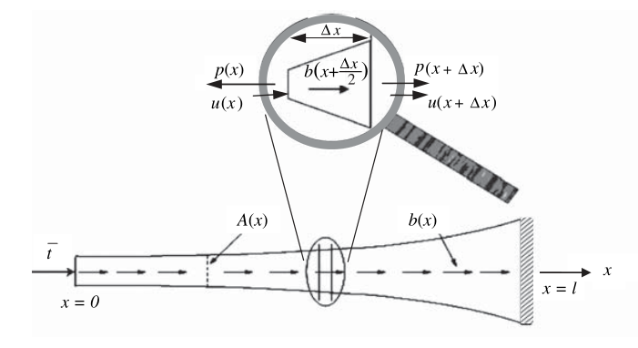
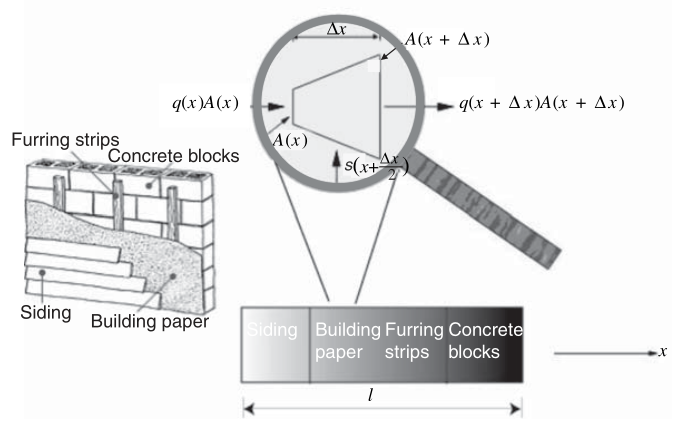
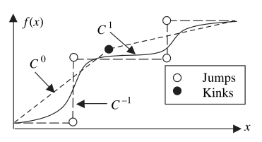

# Chpater 3 Strong and weak forms of one-dimensional problems

**Strong form**: Governing equations along with the boundary conditions

**Weak form**: Integral form of the equations in the strong form ----> Weak continuity requirements

**Finite difference method (FDM)**: 

Strong form -----> A set of discrete equations

**Finite element method (FEM)**: 

Strong form -----> Weak form -----> (Combined with the approximation of functions) -----> Discrete equations

----------

## The strong form in one-dimensional problems

### An axial loaded elastic bar

Internal force $p(x)$; body force $b(x)$ (force per unit length); traction $\overline{t}$ (force per unit area)

$-p(x)+b(x+\frac{\Delta x}{2})\Delta x+p(x+\Delta x)=0$

$\frac{p(x+\Delta x)-p(x)}{\Delta x}+b(x+\frac{\Delta x}{2})=0$

take the limit $\Delta x \rightarrow 0$

$\frac{d p(x)}{dx}+b(x)=0$

Then, linear assumption (def of strain & stress-strain law) is adopted $\Downarrow$

strain is given by:

$\varepsilon(x)=\lim\limits_{\Delta x \rightarrow 0}\frac{u(x+\Delta x)-u(x)}{\Delta x}=\frac{du}{dx}$

Internal force is given by

$p(x)=A(x)\sigma (x)=A(x)E\varepsilon (x)=AE\frac{du}{dx}$

So, **governing equation** (2-order ODE) is given by

$\frac{d}{dx}(AE\frac{du}{dx})+b=0$, ($0<x<l$)

With the boundary conditions at the two ends, the strong form becomes

$\frac{d}{dx}(AE\frac{du}{dx})+b=0$ on $0<x<l$

$\sigma (x=0)=(E\frac{du}{dx})_{x=0}=-\overline{t}$

$u(x=l)=\overline{u}$

> Note that the sign convention for $\sigma$ and $\overline{t}$, former is tension + and compression -, latter is positive x-axis +,negative x-axis -

-------

### Steady-state heat conduction in one dimension

The **form** of heat transfer: conduction, convection, thermal radiation

Conservation of energy:

$s(x+\frac{\Delta x}{2})\Delta x+q(x)A(x)-q(x+\Delta x)A(x+\Delta x)=0$

$\frac{q(x+\Delta x)A(x+\Delta x)-\Delta x+q(x)A(x)}{\Delta x}-s(x+\frac{\Delta x}{2})=0$

Take the limit $\Delta x \rightarrow 0$

$\frac{dqA}{dx}-s=0$

The constitutive equation for heat flow is given by

$q=-k\frac{dT}{dx}$

Then, the governing equation is given by

$\frac{d}{dx}(Ak\frac{dT}{dx})+s=0$

With the boudany conditions at two ends, the strong form becomes

$\frac{d}{dx}(Ak\frac{dT}{dx})+s=0$ on $0<x<l$

$q=-k\frac{dT}{dx}=-\overline{q}$ on $x=0$

$T=\overline{T}$ on $x=l$

> The negative sign in $q=-\overline{q}$ is beacuse the prescribed flux $\overline{q}$ is positive when heat flows out of the bar
------------

### Diffusion in one dimension

P46 Similar to 1D heat conduction...

---------------
## The weak form in one dimension

For the problem of axial loaded elastic bar, ...

use the **weight function** (**test function**) $w(x)$ to multiply the gonverning equation and boudary conditions ...

and integrate over the domian they hold

$\int_0^l w[\frac{d}{dx}(AE\frac{du}{dx})+b]dx=0$, $\forall w$ with $w(l)=0$

$(wA(E\frac{du}{dx}+\overline{t}))_{x=0}=0$, $\forall w$ with $w(l)=0$

> The arbitariness of the weight function $w(x)$ is crucial

Use the integration by parts, the weak form is transformed into

$\int_0^l w[\frac{d}{dx}(AE\frac{du}{dx})+b]dx=(wAE\frac{du}{dx})|_0^l-\int_0^l \frac{dw}{dx}AE\frac{du}{dx}dx+\int_0^lwbdx=0$

For $w(l)=0$ and $(wA(E\frac{du}{dx}+\overline{t}))_{x=0}=0$

$(wA\sigma)_{x=l}-(wA\sigma)_{x=0}-\int_0^l \frac{dw}{dx}AE\frac{du}{dx}dx+\int_0^lbdx=(wA\overline{t})_{x=0}-\int_0^l \frac{dw}{dx}AE\frac{du}{dx}dx+\int_0^lwbdx=0$

So the weak form of the above problem becomes:

$--------------------------$

Find $u(x)$ among the smooth functions that satisfy $u(l)=\overline{u}$ such that

$\int_0^l \frac{dw}{dx}AE\frac{du}{dx}dx=(wA\overline{t})_{x=0}+\int_0^lwbdx$, $\forall w$ with $w(l)=0$

$--------------------------$

**Trial solutions**/ **candidate solutions**: a set of admissible solutions $u(x)$ that satisfy certain conditions

### Boundary conditions

**Essential** boundary conditions: BCs that trial solutions $u(x)$ must saitisfy (Dispalcement)

**Natural** boundary conditions: BCs that emnate naturally from the weak form and trial solution $u(x)$ needed to satisfy (Traction)

### Requirements for using weak form: **Admissible**

Admissible of trial solution: smooth and satisifies the essential boundary conditions

Admissible of weight function: smooth and vanishes the essential boundaries

------------------

## Continuity

$C^n$ fucntion: the derivatives of the function of order $j$ exist (0$\leq j \leq n$) and are continuous functions in the entire domain

> Jumps: Strong discontinuities; Kinks: Weak discontinuities

> In general, the derivative of $C^n$ fucntion is $C^{n-1}$ fucntion
-----------

## The equivalence between the weak and strong forms

**Key to the proof**: The arbitrariness of the weight function $w(x)$

The trial solution $u(x)$ that  satisfies the weak form satisfies the strong form

----------

## One-dimensional stress analysis with arbitary boundary conditions

$\Gamma_u \cup \Gamma_t=\Gamma$

Any boudanry is either an essential boundary or a natural boundary and their union is the enire boundary

$\Gamma_u \cap \Gamma_t=0$

Natural boundary conditions and essential boundary conditions cannot be applied at the same boundary points 

> P58 The two boundaries are said to be complementary

### Strong form for 1D stress analysis 

$\frac{d}{dx}(AE\frac{du}{dx})+b=0$ on $0<x<l$,

$\sigma n=En\frac{du}{dx}=\overline{t}$ on $\Gamma_t$,

$u=\overline{u}$ on $\Gamma_u$

> $n$ -----> the normal vector pointing outwards

### Weak form for 1D stress analysis

$H^1$ is a space of functions with square integrable derivatives and $H^1 \subset C^0$

>P60 $H^1$ contains an infinite number of functions and is called an infinite set

Define two function spaces $U$ and $U_0$ :

$U=\{u(x)|u(x) \in H^1, u=\overline{u}$ on $\Gamma_u\}$

$U_0=\{w(x)|w(x) \in H^1, w=0$ on $\Gamma_u\}$

Use the weight function $w(x)$, the strong form becomes

$\int_{\Omega}w(\frac{d}{dx}(AE\frac{du}{dx})+b)dx=0$, $\forall w$ ,

$(wA(\overline{t}-\sigma n))|_{\Gamma_t}=0$, $\forall w$

For the boundary parts $\Gamma$ can be divided into $\Gamma_t$ and $\Gamma_u$ and $w$ vanishes on $\Gamma_u$

$\int_{\Omega} w[\frac{d}{dx}(AE\frac{du}{dx})+b]dx=(wAE\frac{du}{dx}n)|_{\Gamma_u}+(wAE\frac{du}{dx}n)|_{\Gamma_t}-\int_{\Omega} \frac{dw}{dx}AE\frac{du}{dx}dx+\int_{\Omega}wbdx=0$

So, $\int_{\Omega} \frac{dw}{dx}AE\frac{du}{dx}dx=(wA\overline{t})_{\Gamma_t}+\int_{\Omega}wbdx$

The weak form becomes

$--------------------------$

Find $u(x) \in U$ such that

$\int_{\Omega} \frac{dw}{dx}AE\frac{du}{dx}dx=(wA\overline{t})_{\Gamma_t}+\int_{\Omega}wbdx$, $\forall w \in U_0$

$--------------------------$

-----

## One-dimensional heat conduction with arbitary boundary conditions

Similar with 1D stress analysis... 

-------

## Two-point boundary value problems wit generalized boundary conditions

TWo-point boundary value problem:

$\frac{\partial}{\partial x}(A\kappa \frac{\partial \theta}{\partial x})+f=0$ on $\Omega$

> Diffusion, heat conduction, elastic problems in this Chapter are all of the above form

Generalized boundary conditions:

$(\kappa n \frac{\partial \theta}{\partial x}-\overline{\Phi})+\beta(\theta-\overline{\theta})=0$ on $\Gamma_{\Phi}$

When $\beta$ is a penalty paramerter (large number), the essential boundary conditions become a limiting case of the equation above

then $\Gamma \equiv \Gamma_{\Phi}$

Two approches to deal with the boundary condition: **Penalty method** and **Partition method**

### Strong form for two-point boundary value problems with generalized boundary conditions

+ General strong form for 1D problems-penalty method

$\frac{\partial}{\partial x}(A\kappa \frac{\partial \theta}{\partial x})+f=0$ on $\Omega$

$(\kappa n \frac{\partial \theta}{\partial x}-\overline{\Phi})+\beta(\theta-\overline{\theta})=0$ on $\Gamma$

+ General strong form for 1D problems-partition method

$\frac{\partial}{\partial x}(A\kappa \frac{\partial \theta}{\partial x})+f=0$ on $\Omega$

$(\kappa n \frac{\partial \theta}{\partial x}-\overline{\Phi})+\beta(\theta-\overline{\theta})=0$ on $\Gamma_{\Phi}$

$\theta=\overline{\theta}$ on $\Gamma_{\theta}$

### Weak form for two-point boundary value problems with generalized boundary conditions

+ General weak form for 1D problems-penalty method

Find $\theta(x) \in H^1$ such that

$\int_{\Omega}\frac{dw}{dx}A\kappa\frac{d\theta}{dx}dx-\int_{\Omega}wfdx-wA(\overline{\Phi}-\beta(\theta-\overline{\theta}))|_{\Gamma}=0$, $\forall w \in H^1$

+ General weak form for 1D problems-partition method

Find $\theta(x) \in U$ such that

$\int_{\Omega}\frac{dw}{dx}A\kappa\frac{d\theta}{dx}dx-\int_{\Omega}wfdx-wA(\overline{\Phi}-\beta(\theta-\overline{\theta}))|_{\Gamma_{\overline{\Phi}}}=0$, $\forall w \in U_0$

---------------

## Advection-diffusion (1D)

Conservation principle: the species (material ,energy or state) is conserved in each volume $\Delta x$

i.e. the amount of species entering minus the amount of leaving equals the amount produced

**Notation**:

Concentration of species: $\theta(x)$

Cross section area: $A(x)$

Velocity of the fluid: $v(x)$

Source: $s(x)$

control volume: $\Delta x$

### Strong form of advection-diffusion equation

From the conervation principle

$(Av\theta)_x+(Aq)_x-(Av\theta)_{x+\Delta x}-(Aq)_{x+\Delta x}+s(x+\frac{\Delta x}{2})\Delta x=0$

Take the limit $\Delta x \rightarrow 0$

$\frac{d (Av\theta)}{d x}+\frac{d (Aq)}{d x}-s=0$

For an incompressible flow, the volume of material entering the control volume equals the volume leaving.

$(Av)_x=(Av)_{x+\Delta x}$

Take the limit $\Delta x \rightarrow 0$

$\frac{d (Av)}{d x}=0$

So the governing equation becomes

$\frac{d (Av\theta)}{d x}+\frac{d (Aq)}{d x}-s=\theta \frac{d (Av)}{d x}+Av\frac{d \theta}{dx}+\frac{d (Aq)}{d x}-s=0$

$Av\frac{d \theta}{dx}+\frac{d (Aq)}{d x}-s=0$

Assume the diffusion is linear and use the Fick's first law

$q=-k\frac{d\theta}{dx}$

Then the advection-diffusion equation is as follows

$\underbrace{Av\frac{d \theta}{dx}}_{advection}-\underbrace{\frac{d}{dx}(Ak\frac{d\theta}{dx})}_{Diffusion}-\underbrace{s}_{Source}=0$

With the boundary conditions

$\theta=\overline{\theta}$ on $\Gamma_{\theta}$

$qn=-k\frac{d\theta}{dx}n=\overline{q}$ on $\Gamma_q$

### Weak form of advection-diffusion equation

Multipy the governing eqaution and intergrate over the domain

Intergrate the diffusion term by parts, we can get the weak form:

Find $\theta(x)\in U$ such that

$\int_{\Omega}wAv(\frac{d\theta}{dx})dx+\int_{\Omega}\frac{dw}{dx}Ak\frac{d\theta}{dx}dx-\int_{\Omega}wsdx+(wA\overline{q})|_{\Gamma_q}=0$ for $\forall w \in U_0$

Instead of using the flux boundary condition (natural) above, follow generalized boundary condition can be used

$(-k\frac{d\theta}{dx}+v\theta)n=\overline{q}_T$

Then integrate the first term by parts in the above weak form, we can get

$-\int_{\Omega}\frac{dw}{dx}Av\theta dx+\int_{\Omega}\frac{dw}{dx}Ak\frac{d\theta}{dx}dx-\int_{\Omega}wsdx+(wA\overline{q}_T)|_{\Gamma_q}=0$ 

... ...

------
## Minimum potential energy

### Theorem of minimum potential energy

$------------------------$

The solution of the strong from is the minimizer of

$W(u(x))=\underbrace{\frac{1}{2}\int_{\Omega}AE(\frac{du}{dx})^2dx}_{W_{int}}-\underbrace{(\int_{\Omega}ubdx+(uA\overline{t})|_{\Gamma_t})}_{W_{ext}}$

$------------------------$

Potential energy of the system : $W(u(x))$ -----> functional (function of function)

**The physical meaning**: 

The solution is minimizer (a stationary point) of the potential energy $W$ among all admissible displacement functions

**Proof of equivalence**:

A variation of the function $u(x)$ : $\delta u(x) \equiv \zeta w(x)$

where $w(x)$ is an arbitary function and $0<\zeta\ll1$

Variation in the functional : $\delta W=W(u(x)+\zeta w(x))-W(u(x))\equiv W(u(x)+\delta u(x))-W(u(x))$

For $(U(x)+\zeta w(x)) \in U$, $w(x)$ must vanish on the essential boundary, $w(x)\in U_0$

Variation of in the internal and external work

$\delta W_{int}=\frac{1}{2}\int_{\Omega}AE(\frac{du}{dx}+\zeta\frac{dw}{dx})^2dx-\frac{1}{2}\int_{\Omega}AE(\frac{du}{dx})^2dx=\zeta\int_{\Omega}AE(\frac{du}{dx})(\frac{dw}{dx})dx$

$\delta W_{ext}=\delta W_{ext}^{\Omega}+\delta W_{ext}^{\Gamma}=\int_{\Omega}(u+\zeta w)bdx-\int_{\Omega}(u)bdx+(u+\zeta w)A\overline{t}|_{\Gamma_t}-(u\overline{t})A|_{\Gamma_t}=\zeta(\int_{\Omega}wbdx+(wA\overline{t})|_{\Gamma_t})$

At the minimum of $W(u(x))$, there should be $\delta W=\delta W_{int}-\delta W_{ext}=0$

So we can get the follwoing statement

Find $u\in U$ such that

$\frac{\delta W}{\zeta}=\int_{\Omega}AE(\frac{du}{dx})(\frac{dw}{dx})dx-\int_{\Omega}wbdx-(wA\overline{t})|_{\Gamma_t}=0$ , $w\in U_0$

Alternatively, use the $\delta u$ to replace the $\zeta w$, i.e.

Find $u\in U$ such that

$\delta W=\int_{\Omega}AE(\frac{du}{dx})(\frac{d(\delta u)}{dx})dx-\int_{\Omega}\delta u bdx-(\delta u A\overline{t})|_{\Gamma_t}=0$ , $w\in U_0$

The minimizer of the potential energy functional <--------> The weak form <--------> The strong form

### Principle of virtual work

Use the strain-displacement equation and the stress-strain law

$\delta W=\underbrace{\int_{\Omega}A\sigma\delta \varepsilon dx}_{\delta W_{int}}-\underbrace{\int_{\Omega}b\delta udx-(\overline{t}A\delta u)|_{\Gamma_t}}_{\delta W_{ext}}=0$

So  **the principle of virtual work** can be stated as follows:

The admissible displacement field ($u\in U$) for which the variational in the internal work $\delta W_{int}$ equals the variation in the external work $\delta W_{ext}$ for $\forall \delta u\in U_0$ satisfies equilibrium and boundary conditions.

$W_{int}=\int_{\Omega}w_{int}Adx=\frac{1}{2}\int_{\Omega}AE\varepsilon^2dx$

where $w_{int}$ is the energy per volume called **energy density**

> Some weak forms can be converted to variational principles

> The potential energy theorem holds for any elastic system and the similar variational principle can be formulated for heat conduction

> Variational principles can only be developed for systems that are self-adjoint

----------------------

## Integrability

**Integrability** for the weak form : 

The integrals in the weak form can be evaluated, which requires the smoothness of the trial solution and weight function

A derivative of a function $u(x)$ is called **square integrable** if $W_{int}(\theta)$ is bounded ($W_{int}(\theta)<\infty$)

$W_{int}(\theta)=\frac{1}{2}\int_{\Omega}\kappa A(\frac{d\theta}{dx})^2dx$

**The required smoothness in FEM**: The weight and trial functions are required to posses **square integrable derivatives**

In elasticity, $W_{int}(\theta)$ corresponds to the strain energy

> The value of $\sqrt{W_{int}(\theta)}$ is often called an energy norm

> The notions of required smoothness also have a physical basis (Compatibility of the displacement field, no gaps or overlaps...)

> $C^0$ continuity is enough for the weight and trial functions