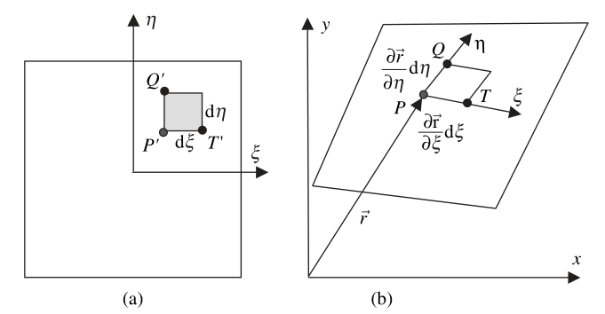

# Chapter 7 Approximations of trial solutions, weight functions and guass quadrature for multidimensional problems

Improve the solution of the finite element soulutions: 1) Element size $h\rightarrow0$ , 2) Higher order approximation polynominal

Isoparametric element ---> treat curved boundaries and able to represent a linear field exactly

## Triangular elements

### Three node triangular elements

Three nodes lienar element

Six nodes quadratic element

Ten nodes cubic element

> P 160
> 
> For quartic or higher order element are seldom developed from simple polynominal expansions.
> 
> In addition, these higher order elements will result in not well conditioned discrete system equations
>
> Other high-order elements like spectral elements developed legendre polynominals will not degrade the conditioning as much

### Triangular coordinates

$\xi_I=\frac{A_I}{A}$, which is equal to the shape function of linear triangular elements

> P175 The more distorted the element, the less its accuracy.

----

## Quadrilateral elements

The construction of shape function $\pmb{N}^e$ $\Downarrow$

+ tensor product method ---> Lagrange elements

Taking products of lower dimensional shape functions and exploiting the Kronecker delta property

+ Serendipity

Tensor product of carefully selected functions to satisfy the Kronecker delta property

### Four node rectangular elements

Tensor product method

$N^e_{K}(x,y)=N^e_{[I,J]}(x,y)=N^e_{I}(x)N^e_{J}(y)$ for $I=1,2$ and  $J=1,2$

### Four node quadrilateral elements

**Isoparametric element**: The physical coordinates are mapped by **the same shape functions** as those for approximation

$x(\xi,\eta)=\pmb{N}^{4Q}\pmb{x}^e$, $y(\xi,\eta)=\pmb{N}^{4Q}\pmb{y}^e$

$\theta(\xi,\eta)=\pmb{N}^{4Q}\pmb{d}^e$

Mapping from the parent to the physical coodrinates system

### Derivatives of isoparametric shape functions

$\pmb{\nabla}\theta=\pmb{B}^e\pmb{d}^e$ where $\pmb{\nabla}=[\frac{\partial}{\partial x},\frac{\partial}{\partial y}]^T$

Use the chain rule

$\begin{bmatrix}
    \frac{\partial N_I^{4Q}}{\partial \xi}\\
    \frac{\partial N_I^{4Q}}{\partial \eta}
\end{bmatrix}=
\begin{bmatrix}
    \frac{\partial x}{\partial \xi} & \frac{\partial y}{\partial \xi}\\
    \frac{\partial x}{\partial \eta} & \frac{\partial y}{\partial \eta}
\end{bmatrix}
\begin{bmatrix}
    \frac{\partial N_I^{4Q}}{\partial x}\\
    \frac{\partial N_I^{4Q}}{\partial y}
\end{bmatrix}
$

$\pmb{G}\pmb{N}^{4Q}_{I}=\pmb{J}^e\pmb{\nabla}\pmb{N}^{4Q}_{I}$ 

$\pmb{B}^e=\pmb{\nabla}\pmb{N}^{4Q}_{I}=(\pmb{J}^e)^{-1}\pmb{G}\pmb{N}^{4Q}_{I}$

where $\pmb{G}=[\frac{\partial}{\partial \xi},\frac{\partial}{\partial \eta}]^T$, 
$\pmb{J}^e=\begin{bmatrix}
    \frac{\partial x}{\partial \xi} & \frac{\partial y}{\partial \xi}\\
    \frac{\partial x}{\partial \eta} & \frac{\partial y}{\partial \eta}
\end{bmatrix}=\pmb{G}\pmb{N}^{4Q}_{I}[\pmb{x}^e, \pmb{y}^e]$ is the Jacobian matrix.

The determinant of the Jacobian matrix must be positive

$\vert \pmb{J}^e \vert\equiv det(\pmb{J}^e)>0$, $\forall e$ and $(x,y)$

> This requirement can be fullfilled if all angles in all quadrilatrals are less than $180\degree$

### High order quadrilateral elements

~

-----

## Guass quadrature in two dimensions

$I=\int\limits_{\Omega}f(\xi,\eta)d\Omega$

### Integration over quadrilateral elements

Mapping from the parent(a) to the physical(b) coodrinates system

$\vec{r}=x\vec{i}+y\vec{j}$

The vectors $\vec{a}=\vec{PT}$ and $\vec{b}=\vec{PQ}$ can be expressed as

$\vec{a}=\frac{\partial \vec{r}}{\partial \xi}d\xi=(\frac{\partial x}{d\xi}\vec{i}+\frac{\partial y}{d\xi}\vec{j})d\xi$

$\vec{b}=\frac{\partial \vec{r}}{\partial \eta}d\eta=(\frac{\partial x}{d\eta}\vec{i}+\frac{\partial y}{d\eta}\vec{j})d\eta$

$d\Omega=\vec{k}\cdot(\vec{a}\times\vec{b})=\vec{k}\cdot
\begin{bmatrix}
    \vec{i} & \vec{j} & \vec{k}\\
    \frac{\partial x}{d\xi}d\xi & \frac{\partial y}{d\xi}d\xi & 0\\
    \frac{\partial x}{d\eta}d\eta & \frac{\partial x}{d\eta}d\eta & 0
\end{bmatrix}=
det(\begin{bmatrix}
    \frac{\partial x}{d\xi} & \frac{\partial y}{d\xi}\\
    \frac{\partial x}{d\eta} & \frac{\partial x}{d\eta}
\end{bmatrix})d\xi d\eta=
\vert \pmb{J}^e \vert d\xi d\eta
$

$I=\int\limits_{\eta=-1}^1\int\limits_{\xi=-1}^1\vert \pmb{J}^e(\xi,\eta)\vert f(\xi,\eta)  d\xi d\eta=\sum\limits_{i=1}^{n_{gp}}\sum\limits_{j=1}^{n_{gp}}W_iW_j\vert \pmb{J}^e(\xi_i,\eta_j)\vert f(\xi_i,\eta_j)$

Similar equation can be concluded for three dimensional elements

$I=\sum\limits_{i=1}^{n_{gp}}\sum\limits_{j=1}^{n_{gp}}\sum\limits_{k=1}^{n_{gp}}W_iW_jW_k\vert \pmb{J}^e(\xi_i,\eta_j,\zeta_k)\vert f(\xi_i,\eta_j,\zeta_k)$

### Integration over triangular elements

$I=\int\limits_{\Omega}f(\xi,\eta)d\Omega=\sum\limits_{i=1}^{n_{gp}}W_i\vert \pmb{J}^e(\xi_i)\vert f(\xi_i)$

....

